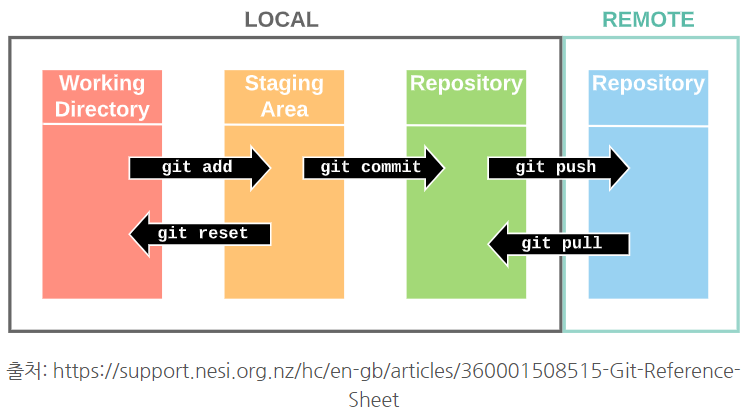

# TIL  _ 2021.06.03 

> 내 두뇌는 내 생각만큼 똑똑하지 않다.  
>
> 니 실력에 잠이오니? 

## github ? Why github? 

### git(버전관리) + hub(공유) : 

### 개발자들이 서로의 코드를 공유하며 오픈소스 프로젝트를 협업,기여 하는 공간

## Git Bash, Typora 

####  시스템을 쉽게 이해하기 위해 분장실, 촬영장, 결과물로 나누어서 이해

### ``Working Directory`` (분장실) : git add . 

### ``Staging Area`` (촬영장) git commit -m ' '

### ``Repository``(결과물)

---

---

## 기본 명령어 정리(Directory, File 생성 삭제)

### 기본 명령어로 디렉토리와 파일생성

|           |  생성   |   삭제   |
| --------- | :-----: | :------: |
| Directory | mkdir ~ | rm -rf ~ |
| File      | touch ~ |   rm ~   |

### ``pwd`` : 현재 위치 확인

### ``is`` : 목록확인

### ``git init``  ~ : 관리 디렉토리 선언 (분장실로 인테리어 하는 개념)

### ``git add . `` :  작성 후 파일을 저장하는 역활(분장실에서 stage로 )

### ``git status`` : 작성된 파일이 stage로 넘어왔는지 확인

### ``git commit -m ~`` : add로 저장 후 commit으로 작업에 대한 메시지를 작성(여기까지 해야 저장 완료)

### ``git commit --amend`` : 커밋메시지 변경

### ``git log or git log --oneline``  :  로그 확인

---

---

> Python developer , Data Analist, Data Scientist