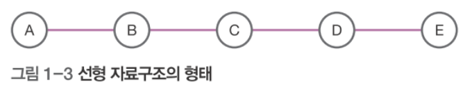
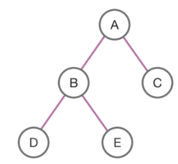
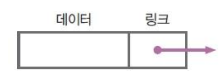

# 21.07.05_알고리즘 특강(python)

## 강의개요

- 자료구조와 알고리즘 기본을 탄탄하게

## 목표

- 자료구조 및 알고리즘에 대한 개념 이해
- 파이썬 코딩을 통한 알고리즘 구현

## 교육내용

- 자료구조 기본 개념

- 기본 알고리즘

- 파이썬 프로그래밍
- 현업 알고리즘 문제 테스트

---

### 자료구조와 알고리즘

- 단순, ``선형``, ``비선형``, 파일 : 선형, 비선형 중요함

- 비선형 : 트리, 그래프

  

#### 선형자료구조 : 선형리스트, 연결리스트, 스택, 큐

#### 비선형 자료구조 : 트리, 그래프

### 알고리즘 : 어떤 문제를 해결해 가는 논리적인 과정

#### 알고리즘 표현방법

- 순서도
- 의사코드
- 프로그램 코드 표현

- 혼합형태

### 알고리즘 성능 : 소요시간을 기준으로 시간복잡도(time complexity)

- 알고리즘 성능표기 : 빅-오 O(f(n))

#### 선형리스트 :

- 줄서는 것처럼 데이터를 일정한 순서로 나열

- 입력 순서대로 저장하는 데이터에 적당

- ex) 카톡으로 연락 온 친구를 배열을 이용해 표현

- 물리적으로 붙어있음

- 대용량에서는 오버헤드 발생

#### 연결리스트 :

- 논리적으로는 붙어있지만 물리적으로는 떨어져있음

- 대용량이라도 오버헤드 발생안함

- 노드(node)구조 : 데이터와 링크로 구성

- 가장 첫번째 시작하는 노트를 head, 링크가 없는 노트가 마지막 노드

### 스택(Stack) :  입구와 출구가 한방향, (선입 후출, 후입 선출)

- 크기의 제한이 있음
- ``push`` : 데이터 삽입, ``pop`` : 데이터 추출, ``top`` : 가장위의 데이터

