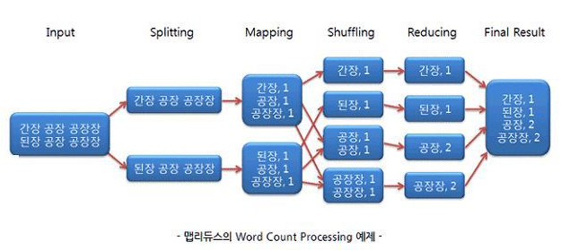

# NoSQL(Not Only SQL)

## 특징

- 관계형 모델을 사용하지 않으며 테이블간의 조인 기능 없음

- 직접 프로그래밍을 하는 등의 비SQL 인터페이스를 통한 데이터 액세스

- 대부분 여러 대의 데이터베이스 서버를 묶어서(클러스터링) 하나의 데이터베이스를 구성

- 관계형 데이터베이스에서는 지원하는 Data처리 완결성(Transaction ACID 지원) 미보장

- 데이터의 스키마와 속성들을 다양하게 수용 및 동적 정의 (Schema-less)

- 데이터베이스의 중단 없는 서비스와 자동 복구 기능지원

- 다수가 Open Source로 제공

- 확장성, 가용성, 높은 성능

  

##### NoSQL은 초고용량 데이터 처리 등 성능에 특화된 목적을 위해, 비관계형 데이터 저장소에, 

##### 비구조적인 데이터를 저장하기 위한 분산 저장 시스템이라고 볼 수 있음

## NoSQL 카테고리

- Document data stores
- columnar data stores
- key/value data stores
- graph data stores

## 맵 리듀스(MapReduce)

- MapReduce : 비 구조적 데이터 처리과정

- Input -> Splitting->Mapping->Shuffling->Reducing->Final Result

