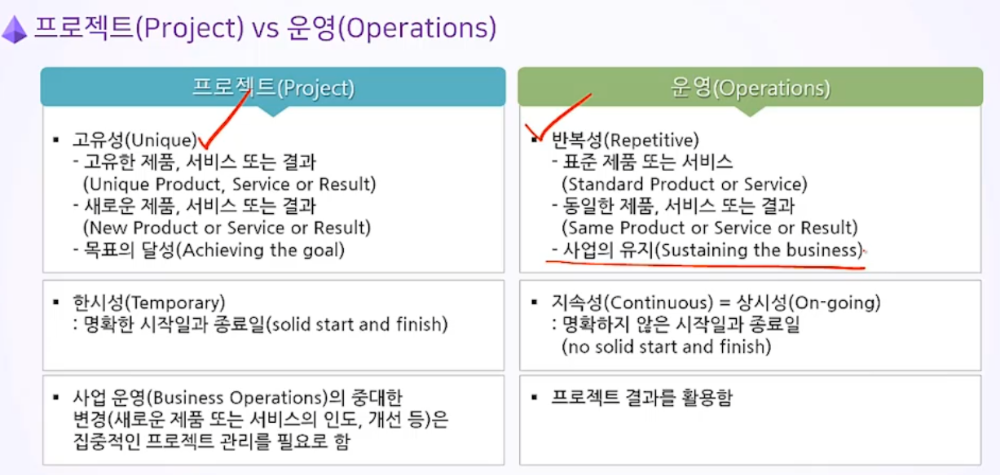
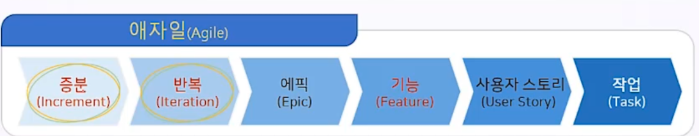
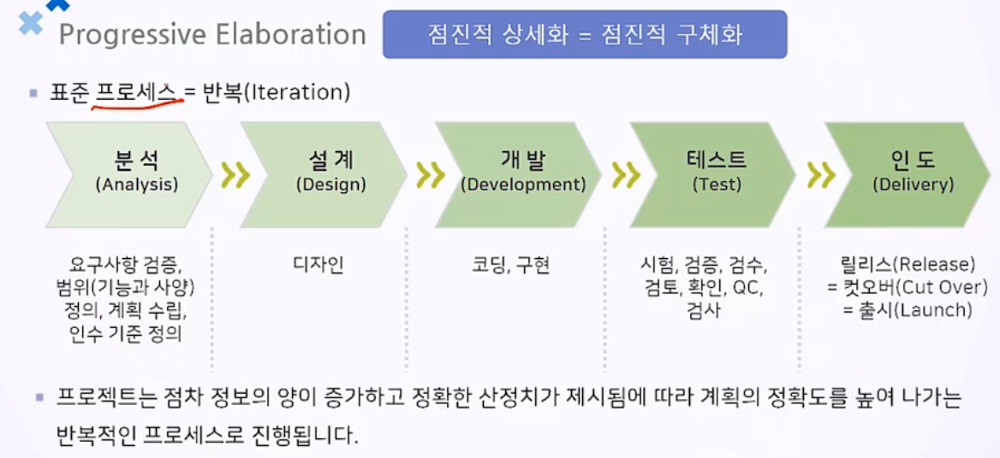

# 애자일 프로젝트

---

## 1. 프로젝트의 이해

- 

### 프로젝트 : 고유한 목표(제품, 서비스,결과)를 산출하기 위해 수행하는 한시적 노력

### 프로젝트 업무의 가치

- 조직의 역사도 프로젝트의 역사

- 프로젝트 관리는 1년 후, 3년 후 조직의 미래모습을 주도적인 기획으로 개척

### 프로젝트 관리자(PM)는 조직의 핵심 인력

- 경영 전략을 프로젝트화 하고, 프로젝트 중심으로 성장 및 발전

- 프로젝트 관리 

  - 프로젝트 관리 방법론은 제안과 실행을 성공시키기 위한 필수요건

  - 프로젝트 관리 정보 시스템(PMIS)을 사용하는 기업이 늘어남

  - 많은 조직들이 프로젝트 관리 역량 전문화를 위해 PMO를 운영

    

### 프로젝트의 특징 : 산출물

- 최종산출물 : 계약된 용량을 발전할 수 있는 발전소
- 중간 산출물 : 도면, 사양서, 검사 성적서 등

### 애자일(Agile)과 워터풀(Waterfall)

- 애자일 : 계획-분석-설계-개발-시험-유지보수

  

  - 애자일은 협업을 통한 유연한 대처가 쉽고, 유저중심적 프로세스로

    개선에 대한 장점이 있다

  - 적응형 프로젝트 라이프사이클(Adaptive Project Life Cycle) : 변화에적응

- 워터풀 : 계획-요구분석-설계-개발-시험-유지보수

  

  - 체계적

### Temporary(한시성)

- 시작과 끝이 존재

### Uncertain(불확실성)

- Progressive Elaboration : 모든 프로젝트는 불확싱함으로 점진적으로 상세화

## Keypoint

- 조직은 경영전략을 프로젝트화 하고, 프로젝트중심으로 성장 및 발전

- 조직의 성장과 발전을 위해 PM의 역량이 매우 중요

- 프로젝트(Project) 특징

  - 고유함(Unique), 한시적(Temporary)
  - 불확실(Uncertain) -> 점진적 상세화(Progressive Elaboration)
  - 변화를 추진
  - 비지니스 가치창줄

  

- 운영(Operation)의 특징

  - 상시적(On-going), 반복적(Repetitive)

### 프로젝트와 운영의 상호 선순환을 통해 조직의 전략적목표 달성

