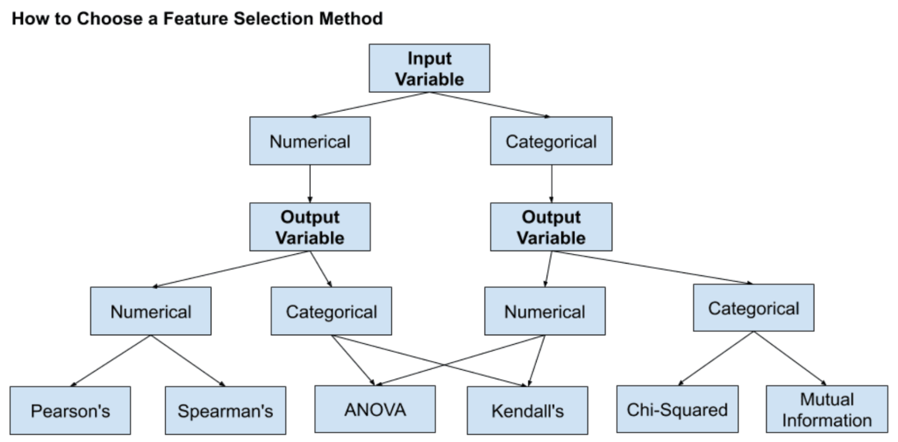

# 2021.06.09

> 알아들을 수 있을때까지 복습하기..ㅠ.ㅠ

# 모델의 분류와 정답

|      |       | 실제           | 정답           |
| ---- | ----- | -------------- | -------------- |
|      |       | True           | False          |
| 분류 | True  | True Positive  | False Positive |
| 결과 | False | False Negative | True Negative  |

### True Positive(TP) : 실제 True를 True로 예측

###  False Positive(FP) : 실제 False 를 True 로 예측

### False Negative(FN) : 실제 True를 False로 예측

### True Negative(TN) : 실제False를 False로 예측

---

## Precision, Recall and Accuracy

## 1. Precision(정밀도)

### 모델이 True라고 분류한 것 중 실제 True 인 것의 비율Positive 정답률, PPV 라고도 불림 

#### ex) 날씨 예측 모델이 맑다고 예측했는데,  실제 날씨가 맑았는지를 살펴보는 지표

## 2. Recall(재현율)

### 재현율은 실제 True인 것 중에서 모델이  True 라고 예측한 것의 비율

#### ex) 날씨가 맑은 날 중에서 모델이 맑다고 예측한 비율을 나타낸 지표

### ``정밀도와 재현율은 바라보는 관점의 차이이다. precision 은 모델의 관점 recall은 실제 정답(data)의 입장에서 정답을 정답이라고 맞춘 경우를 바라보고 있다.``

## 3. Accuracy(정확도)

### true를 true라고 예측한 경우도 옳지만 false를 false라고 예측한 경우(True Negative)도 옮은 경우이다. 이때 해당 경우를 고려하는 지표가 바로 정확도(Accuracy)이다 

---

# 데이터 형식에 따른 참고 방법

## 인풋데이터와 아웃풋데이터의 형식에 따라 참고해야할 자료가 달라진다

### ex1) input은 numerical ,output은 categorical 이면 kendall's 참고

### ex2 ) input은 numerical, output도 numerical 이면 pearson's 참고

---

# 용어

## covariance : 공분산

#### 분산 : 한 변수의 평균값을 중심으로 퍼져있는 평균적인 1차원적인 거리의 개념(언제나 양수)

#### 공분산 : 2차원 적인 방향의 개념(양,음수 가능),

## correlation : 상관관계, 연관성

## multicollinearity : 다중공선성(차원의 저주)

### 회귀분석에서 사용된 모형의 일부예측 변수가 다른예측변수와 상관정도가 높아 데이터 분석 시 부정적인 영향을 미치는 현상을 말함 . .상관관계가 높은 변수는 통합시켜야함(칼럼 수 줄이기)

---

---

